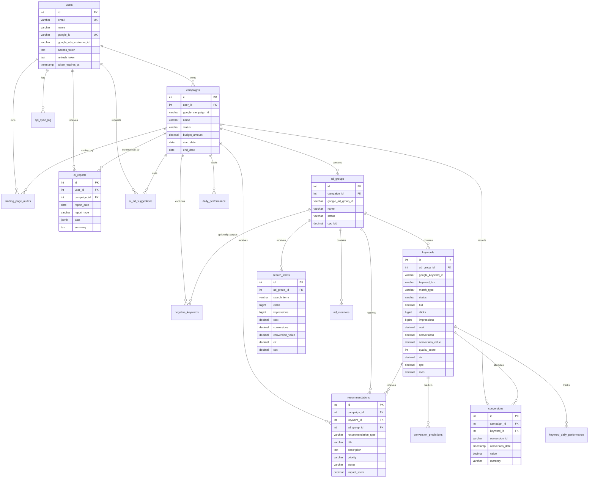

# Entity Relationship Diagram

## Core Relationships

| From | To | Type | Purpose |
|---|---|---|---|
| users | campaigns | 1:N | One advertiser can connect many Google Ads campaigns |
| campaigns | ad_groups | 1:N | Campaign structure from Google Ads |
| ad_groups | keywords | 1:N | Keyword performance and optimization unit |
| ad_groups | search_terms | 1:N | Raw query mining for new and negative keywords |
| campaigns | daily_performance | 1:N | Dashboard trend metrics by day |
| keywords | keyword_daily_performance | 1:N | Keyword-level history and ML features |
| campaigns/keywords/ad_groups | recommendations | 1:N | AI optimization actions |
| users/campaigns | ai_reports | 1:N | Daily automated optimization report |

## Design Notes

- `user_id` enforces tenant ownership.
- Google Ads external IDs are stored separately from internal primary keys.
- JSONB is used for flexible AI artifacts such as reports, ad suggestions and audit findings.
- Daily fact tables support date filters: 7 days, 30 days, 90 days and custom ranges.
